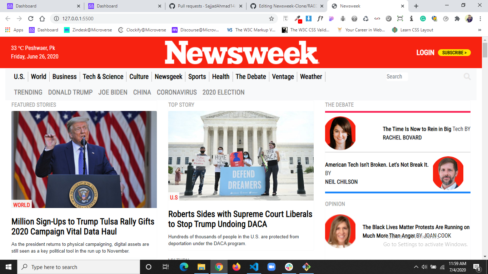
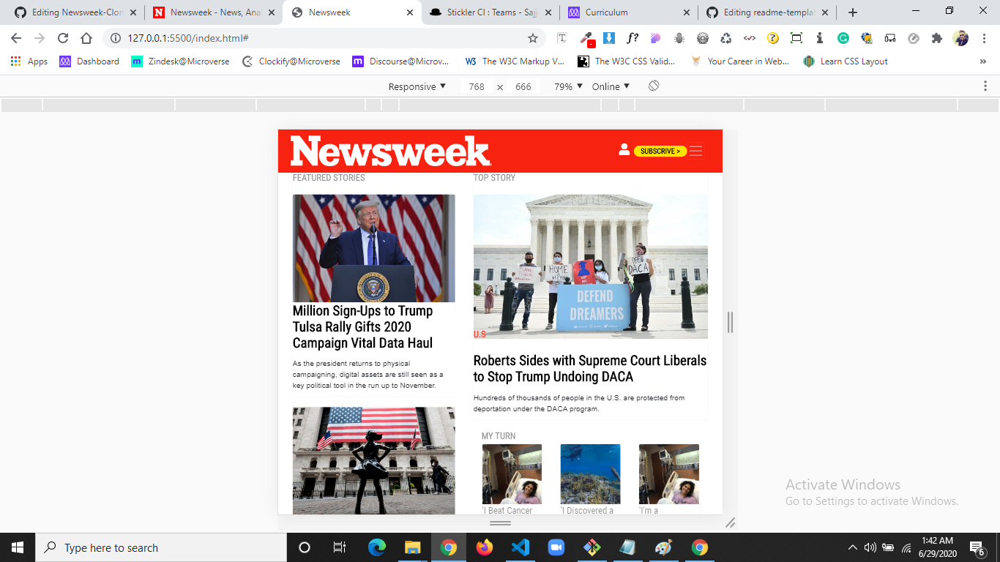
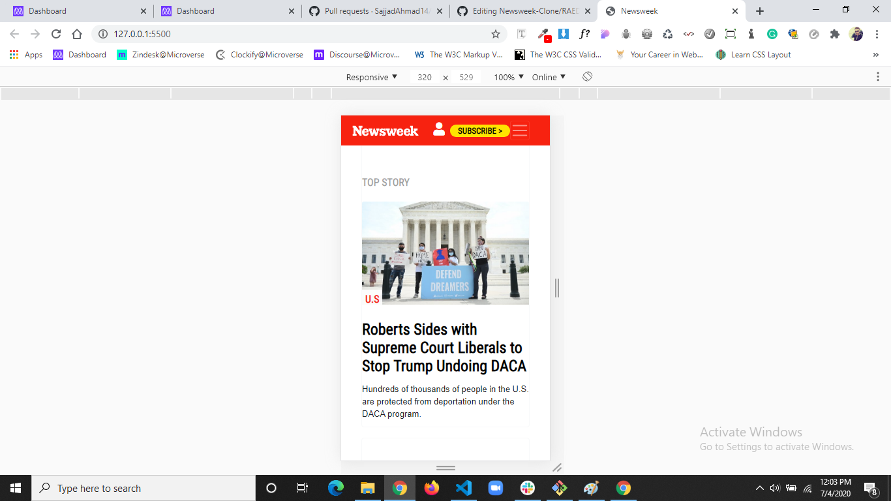

# Newsweek Clone

> This website design is inspired by Newsweek.com. It's purely built with Bootstrap 4.

Additional description about the project and its features.

## Built With

- HTML AND CSS
- Bootstrap 4

## Live Demo

[Live Demo Link](https://rawcdn.githack.com/SajjadAhmad14/Newsweek-Clone/ec060612ef3b0466525a9a6cce9b6b63030226f6/index.html)

To get a local copy up and running follow these simple example steps.

### No Prerequisites

### No Setup Required

### Go to https://github.com/SajjadAhmad14/Newsweek-Clone

### Fork it or Contribute in it

## Authors

👤 **Author1**

- Github: [@SajjadAhmad14](https://github.com/SajjadAhmad14)
- Twitter: [@Sajjad_Ahmad14](https://twitter.com/Sajjad_Ahmad14)
- Linkedin: [linkedin](https://www.linkedin.com/in/sajjad-ahmad-86102117a/)

## 🤝 Contributing

Contributions, issues and feature requests are welcome!

Feel free to check the [issues page](https://github.com/SajjadAhmad14/Newsweek-Clone/issues).

## Show your support

Give a ⭐️ if you like this project!

## Acknowledgments

- Hat tip to anyone whose code was used
- Inspiration
- etc

## 📝 License

This project is [MIT](lic.url) licensed.
